<div align="center">
  
  
  
  

  <br/><br/>

  <h1> HireRank &mdash; Project Athena</h1>
  <p><b>Next-Generation Autonomous Technical Interview Platform with Verifiable CV Integrity & Evidence-First Scoring.</b></p>

  <p>
    
    
    
    
    
    
    
  </p>
</div>

<br/>

## Table of Contents

1. [Overview](#-overview)
2. [Core Pillars](#️-hirerank-core-pillars)
3. [End-to-End Flowchart](#-end-to-end-flowchart)
4. [System Architecture](#-system-architecture--technology-stack)
5. [Project Structure](#-project-structure)
6. [Data Model](#-data-model-srctypesathenats)
7. [API Reference](#-api-reference)
8. [Contextual Integrity Timeline (CV Engine)](#-contextual-integrity-timeline-cv-engine)
9. [Getting Started](#-getting-started)
10. [Environment Variables](#-environment-variables)
11. [Usage Walkthrough](#-usage-walkthrough)
12. [Design Philosophy](#-design-philosophy)
13. [Roadmap Ideas](#-roadmap-ideas)
14. [Disclaimer](#-disclaimer)

---

##  Overview

**HireRank** is an enterprise-grade AI technical interview platform designed to elevate talent assessment through verifiable behavioral integrity and deep semantic evaluation. It combines **Edge-Computed Computer Vision** with **Cloud LLM Intelligence (Groq + Llama 3.3 70B)** to create a realistic, adaptive, and evidence-grounded interview chamber.

Unlike traditional proctoring tools that rely on aggressive auto-disqualification, **Project Athena** introduces the **Contextual Integrity Timeline** &mdash; logging observable events (candidate out of frame, multiple faces, tab switching) as timestamped **Review Markers** for human recruiters to inspect, while preserving candidate dignity and avoiding false-positive rejections.

The application is a single Next.js 14 (App Router) project that serves **two role-based portals** from one authenticated shell:

- A **Candidate Portal** for reviewing invitations, taking live AI-proctored interviews, and receiving growth feedback.
- A **Recruiter Portal** for bulk-processing resumes, sending interview invitations, and triaging finished candidates on a review dashboard.

---

##  HireRank Core Pillars

### 1. Resume-to-Reality
Ingests a candidate's resume (PDF or pasted text) alongside the target Job Description to automatically extract key technical claims and formulate **3 Candidate-Reviewable Verification Topics** that anchor the interview questioning.

### 2. Adaptive Question Engine
Dynamically branches follow-up questions based on the candidate's spoken responses and live code, enforced by backend guardrails allowing a **maximum of 2 follow-ups per competency** before the engine rotates to the next topic.

### 3. Explain-While-You-Build
Seamlessly embeds the Monaco Editor (Python, JavaScript, TypeScript) side-by-side with the webcam feed and live speech captions, so candidates can write code and speak simultaneously without modal barriers.

### 4. Evidence-First Scoring
Every rubric score returned by the LLM is backed by an **exact verbatim quote** and a **transcript timestamp `[MM:SS]`** cited directly from the interview conversation &mdash; no scoring without a paper trail.

### 5. Dual-Role Post-Interview Portals
- **Recruiter Triage Dashboard:** Contextual Integrity Timeline with clickable review markers that jump directly to the exact turn in the transcript, competency radar maps, and fast-track hiring decisions (Hire / Next Round / Hold).
- **Candidate Growth Coach:** A constructive development report providing prioritized study topics, gap analyses, and a technical mastery roadmap.

---

##  End-to-End Flowchart

The diagram below traces the full lifecycle of a candidate through HireRank: authentication, resume ingestion, the adaptive interview loop, real-time integrity monitoring, and the post-interview scoring/triage split between the two portals.

```mermaid
flowchart TD
    Start([Visitor opens HireRank]) --> Auth{Signed in?}
    Auth -- "No" --> Gate[SignInGate: choose Recruiter or Candidate role]
    Gate --> AuthModal[Mock Auth: sign in / create identity]
    AuthModal --> RoleCheck{Selected role}
    Auth -- "Yes" --> RoleCheck

    RoleCheck -- Recruiter --> RecPortal[Recruiter Portal]
    RoleCheck -- Candidate --> CandPortal[Candidate Portal]

    %% ===================== RECRUITER SIDE =====================
    subgraph RECRUITER["Recruiter Workflow"]
        RecPortal --> BulkUpload["Upload multiple resumes (PDF)"]
        BulkUpload --> ParseAPI["/api/parse-resume\n(pdf2json text extraction)"]
        ParseAPI --> ExtractAPI["/api/extract-candidate-info\n(Groq LLM: name, email, skills)"]
        ExtractAPI --> Queue["Candidate Queue built\n(status: ready / error)"]
        Queue --> SendEmail["/api/send-invitation-email\nSend single or bulk invites"]
        SendEmail --> InviteStore[("invitationStore\nlocalStorage")]
        RecPortal --> Dashboard["Recruiter Triage Dashboard"]
        Dashboard --> Filter["Filter by status:\nall / hire / next_round / hold"]
        Dashboard --> Radar["Competency Radar + Score Cards"]
        Dashboard --> Timeline["Contextual Integrity Timeline\n(clickable Review Markers)"]
        Timeline --> JumpTranscript["Jump to exact transcript turn"]
        Dashboard --> Decision{"Triage decision"}
        Decision -->|Hire| Hired[("Mark Hire")]
        Decision -->|Next Round| NextRound[("Mark Next Round")]
        Decision -->|Hold| Hold[("Mark Hold")]
    end

    InviteStore -. "invite token / link" .-> CandPortal

    %% ===================== CANDIDATE SIDE =====================
    subgraph CANDIDATE["Candidate Workflow"]
        CandPortal --> Tabs{Choose tab}
        Tabs -- Invitations --> InviteList["View pending invitations"]
        InviteList --> StartInvite["Start invited interview"]
        Tabs -- "Practice Chamber" --> CustomPractice["Start self-paced practice"]
        Tabs -- "My Interviews" --> PastResults["View past scores & feedback"]

        StartInvite --> Setup
        CustomPractice --> Setup

        Setup["Setup Mode:\nPaste / Upload resume + Job Description"]
        Setup --> UploadCheck{Resume source}
        UploadCheck -- "Upload PDF" --> ParseAPI2["/api/parse-resume"]
        UploadCheck -- "Paste text" --> ClaimsExtract
        ParseAPI2 --> ClaimsExtract["/api/athena/extract-claims\nExtract technical claims"]
        ClaimsExtract --> VerifyTopics["Resume-to-Reality Modal:\n3 Verification Topics generated"]
        VerifyTopics --> ConsentGate["Candidate confirms & agrees to rules"]
        ConsentGate --> InitQuestion["/api/athena/adaptive-question\nGenerate opening question"]

        InitQuestion --> Interview[["Live Interview Room"]]
    end

    %% ===================== LIVE INTERVIEW LOOP =====================
    subgraph LOOP["Live Interview Chamber (per turn)"]
        Interview --> CamOn["Webcam + MediaPipe FaceMesh\ninitializes (client-side only)"]
        CamOn --> Frame["Analyze video frame every tick"]
        Frame --> FaceCheck{Face count}
        FaceCheck -- "0 faces (sustained)" --> MarkerMissing["Log Review Marker:\nface_missing"]
        FaceCheck -- ">1 faces (sustained)" --> MarkerMulti["Log Review Marker:\nmultiple_faces"]
        FaceCheck -- "1 face" --> YawScore["Compute yaw-based\nconfidence score"]
        MarkerMissing --> Timeline
        MarkerMulti --> Timeline
        YawScore --> ConfidenceUI["Update live confidence meter"]

        Interview --> TabWatch["Browser visibility listener"]
        TabWatch -- "Tab backgrounded" --> MarkerTab["Log Review Marker:\ntab_switch"]
        MarkerTab --> Timeline

        Interview --> AnswerMode{"Answer type"}
        AnswerMode -- "Speak" --> SpeechAPI["Web Speech API\nLive captions"]
        SpeechAPI --> AudioBlob["Record audio segment"]
        AudioBlob --> TranscribeAPI["/api/transcribe\nGroq whisper-large-v3"]
        AnswerMode -- "Type answer" --> ManualText["Manual text submit"]
        AnswerMode -- "Code" --> MonacoEditor["Monaco Editor\n(Python / JS / TS)"]

        TranscribeAPI --> EvaluateAPI
        ManualText --> EvaluateAPI
        MonacoEditor --> EvaluateAPI
        EvaluateAPI["/api/evaluate\nScore this turn + reasoning"]
        EvaluateAPI --> FollowUpCheck{"Follow-ups used\nfor this competency < 2?"}
        FollowUpCheck -- "Yes" --> AdaptiveAPI["/api/athena/adaptive-question\nGenerate follow-up"]
        FollowUpCheck -- "No" --> NextCompetency["Rotate to next competency\n/ next Verification Topic"]
        AdaptiveAPI --> Interview
        NextCompetency --> HintCheck{"Candidate requests hint?"}
        HintCheck -- Yes --> HintAPI["/api/get-hint\nContextual nudge, no answer leak"]
        HintAPI --> Interview
        HintCheck -- No --> MoreTopics{"More Verification\nTopics remaining?"}
        MoreTopics -- Yes --> Interview
        MoreTopics -- No --> Finish["Candidate ends interview"]
    end

    Finish --> EvidenceScore["/api/athena/evidence-score\nFinal rubric scoring:\nverbatim quote + timestamp per criterion"]
    EvidenceScore --> BuildSession["Assemble CandidateSessionRecord:\nscores, transcript, review markers,\nrubric evidence, study topics"]
    BuildSession --> SaveSession[("candidateStore\nlocalStorage")]
    SaveSession --> UpdateInvite["updateInvitationStatus\n(if linked to an invite)"]
    UpdateInvite --> Split{"Who views results?"}

    Split -- Candidate --> GrowthCoach["Candidate Growth Coach:\nstudy topics + roadmap"]
    Split -- Recruiter --> Dashboard

    GrowthCoach --> End1([Candidate session complete])
    Decision --> End2([Recruiter triage recorded])
```



---

##  System Architecture & Technology Stack

| Layer | Technology | Purpose |
|---|---|---|
| **Framework** | Next.js 14 (App Router), React 18, TypeScript | Unified full-stack app: client UI + serverless API routes |
| **Styling / Motion** | Tailwind CSS, Framer Motion | Utility-first styling, animated transitions and glow UI |
| **AI NLP & Speech** | Groq Cloud SDK (`llama-3.3-70b-versatile`, `whisper-large-v3`), Web Speech API | Question generation, adaptive follow-ups, evidence-first scoring, transcription, live captions |
| **Edge Computer Vision** | MediaPipe FaceMesh + Camera Utils | Multi-face detection, client-side yaw heuristics &mdash; **no video is ever uploaded to a server** |
| **Code Workspace** | Monaco Editor (`@monaco-editor/react`) | In-browser Python / JavaScript / TypeScript editor for live coding answers |
| **Resume Parsing** | `pdf2json` | Server-side PDF text extraction for resumes |
| **Rate Limiting (optional)** | `@upstash/ratelimit`, `@upstash/redis`, `@vercel/kv` | Protects LLM-backed API routes from abuse when configured |
| **Analytics / Visuals** | Recharts | Radar charts and score breakdowns on the Recruiter Dashboard |
| **Icons** | `lucide-react` | Iconography across both portals |
| **Persistence** | Browser `localStorage` (via small store modules) | Candidate sessions, invitations, and auth identity &mdash; no external database required to run the demo |

> **Note:** This project uses browser `localStorage` as its persistence layer (see `src/lib/candidateStore.ts` and `src/lib/invitationStore.ts`), so it runs entirely without a database for local development and demos. For production you would swap these stores for a real database and add server-side session/auth handling.

---

##  Project Structure

```
CTRL-C-CTRL-V-main/
├── HIRE_RANK_JUDGE_PITCH_DOCUMENT.md      # Pitch/judging narrative for the project
├── public/
│   └── HireRank_Pitch_and_Architecture_Guide.html
├── src/
│   ├── app/
│   │   ├── layout.tsx                      # Root layout, fonts, global providers
│   │   ├── page.tsx                        # Entry point: auth gate -> role routing
│   │   ├── globals.css
│   │   └── api/                            # Serverless API routes (see API Reference)
│   │       ├── athena/
│   │       │   ├── adaptive-question/route.ts
│   │       │   ├── evidence-score/route.ts
│   │       │   └── extract-claims/route.ts
│   │       ├── evaluate/route.ts
│   │       ├── extract-candidate-info/route.ts
│   │       ├── generate-question/route.ts
│   │       ├── get-hint/route.ts
│   │       ├── parse-resume/route.ts
│   │       ├── process-audio/route.ts
│   │       ├── send-invitation-email/route.ts
│   │       └── transcribe/route.ts
│   ├── components/
│   │   ├── InterviewRoom.tsx               # Core live-interview chamber (webcam, editor, captions, timer)
│   │   ├── Dashboard.tsx                   # Shared post-answer scoring visualization
│   │   ├── athena/
│   │   │   ├── AthenaLoadingSkeleton.tsx
│   │   │   ├── CandidateGrowthCoach.tsx    # Study roadmap for candidates
│   │   │   ├── LiveCaptions.tsx            # Real-time speech captioning overlay
│   │   │   ├── RecruiterDashboard.tsx      # Competency radar + integrity timeline
│   │   │   └── ResumeToRealityModal.tsx    # Verification topic confirmation modal
│   │   ├── auth/
│   │   │   ├── AuthModal.tsx
│   │   │   └── SignInGate.tsx              # First screen: role + identity selection
│   │   ├── candidate/
│   │   │   └── CandidatePortal.tsx         # Invitations / My Interviews / Practice Chamber tabs
│   │   ├── recruiter/
│   │   │   └── RecruiterPortal.tsx         # Bulk resume upload, invites, triage dashboard
│   │   └── ui/
│   │       ├── button.tsx
│   │       └── card.tsx
│   ├── context/
│   │   └── AuthContext.tsx                 # Mock auth/session + role switching
│   ├── lib/
│   │   ├── candidateStore.ts               # Persist/retrieve CandidateSessionRecord objects
│   │   ├── cvIntegrity.ts                  # CvIntegrityTracker: frame analysis + Review Markers
│   │   ├── groq.ts                         # Groq SDK client initialization helper
│   │   ├── invitationStore.ts              # Persist/retrieve interview invitations
│   │   └── ratelimit.ts                    # Optional Upstash-based rate limiting
│   └── types/
│       ├── athena.ts                       # Core interview/evidence/data types
│       └── auth.ts                         # User / role / session types
├── next.config.mjs
├── tailwind.config.ts
├── tsconfig.json
└── package.json
```

---

##  Data Model (`src/types/athena.ts`)

The entire interview is described by a small set of well-typed records:

- **`VerificationTopic`** &mdash; a resume claim turned into an interview focus area (`sourceClaim`, `competency`, `suggestedQuestions`).
- **`ReviewMarker`** &mdash; a timestamped integrity event of type `face_missing`, `multiple_faces`, `tab_switch`, or `audio_anomaly`, with a `severity` of `low` / `medium` / `high`.
- **`TranscriptTurn`** &mdash; one turn of the conversation (`speaker`, `timestamp`, `text`, optional `codeSnippet` and `competency`).
- **`RubricEvidenceItem`** &mdash; a scored criterion (0&ndash;100) with a mandatory `verbatimQuote`, `timestamp`, `reasoning`, and whether it represents a `strength` or a `gap`.
- **`CandidateStudyTopic`** &mdash; a detected gap with a `recommendedAction`, priority, and suggested resources for the Growth Coach.
- **`AthenaCompetencyState`** &mdash; tracks the `currentCompetency`, `followUpCount` (capped at 2), and how many competencies have been completed.
- **`InterviewSessionData`** &mdash; the full session bundle: job description, resume text, verification topics, transcript, review markers, rubric evidence, study topics, `overallScore`, and `triageStatus` (`pending` / `hire` / `hold` / `next_round`).

---

## 🔌 API Reference

All routes live under `src/app/api/` and are called from the client via `fetch`. Every LLM-backed route uses the Groq SDK client from `src/lib/groq.ts`.

| Route | Purpose |
|---|---|
| `POST /api/parse-resume` | Extracts raw text from an uploaded PDF resume using `pdf2json`. Used by both the candidate setup flow and the recruiter's bulk upload flow. |
| `POST /api/extract-candidate-info` | Uses the LLM to pull structured candidate info (name, email, key skills) out of parsed resume text, for the recruiter's bulk queue. |
| `POST /api/athena/extract-claims` | Cross-references resume text against the Job Description to extract technical claims and generate the **3 Verification Topics**. |
| `POST /api/athena/adaptive-question` | Generates the opening question, competency follow-ups (max 2 per competency), or the next topic's question, based on `AthenaCompetencyState` and conversation history. |
| `POST /api/transcribe` | Sends a recorded audio segment to Groq's `whisper-large-v3` for speech-to-text transcription. |
| `POST /api/process-audio` | Supporting audio-processing utility route used alongside transcription/capture. |
| `POST /api/evaluate` | Scores an individual answer turn (used to drive the live Dashboard feedback and to decide whether a follow-up is warranted). |
| `POST /api/athena/evidence-score` | Runs the final **Evidence-First Scoring** pass across the whole transcript, returning `RubricEvidenceItem[]` with verbatim quotes and timestamps, plus overall/technical/communication scores. |
| `POST /api/get-hint` | Produces a contextual hint for the candidate without revealing the answer outright. |
| `POST /api/generate-question` | General-purpose question generation helper (used outside the strict adaptive-competency loop, e.g. simpler practice flows). |
| `POST /api/send-invitation-email` | Sends (or simulates sending) an interview invitation email to a queued candidate, and registers the invitation in `invitationStore`. |

> Routes that call Groq can optionally be protected by `src/lib/ratelimit.ts`, which uses Upstash Redis when `UPSTASH_REDIS_REST_URL` / `UPSTASH_REDIS_REST_TOKEN` are configured; otherwise rate limiting is a no-op.

---

##  Contextual Integrity Timeline (CV Engine)

Implemented in `src/lib/cvIntegrity.ts` via the `CvIntegrityTracker` class, this engine runs **entirely client-side** against MediaPipe FaceMesh landmarks &mdash; no frame or video is ever sent to a server.

- **Zero faces detected** for a sustained run of frames → confidence drops to `0`, a debounced `face_missing` marker (severity `medium`) is logged.
- **More than one face detected** for a sustained run of frames → confidence drops to `30`, a debounced `multiple_faces` marker (severity `high`) is logged.
- **Exactly one face** → a yaw ratio is computed from nose/eye landmark distances to estimate how centered/attentive the candidate is, producing a live confidence score between `10` and `100`.
- **Tab/window backgrounded** → the page's `visibilitychange` listener fires `createTabSwitchMarker`, logging a `tab_switch` marker (severity `medium`).
- All markers are **debounced** (minimum 8 seconds between similar markers) to avoid spamming the timeline, and every marker carries a precise `elapsedSeconds` / `MM:SS` timestamp so recruiters can jump straight to that moment in the transcript.

Crucially, **no marker auto-disqualifies a candidate** &mdash; they are purely advisory signals surfaced on the Recruiter Dashboard's Contextual Integrity Timeline for a human to interpret in context.

---

## Getting Started

### Prerequisites
- Node.js 18+ and npm
- A [Groq API key](https://console.groq.com/) (required &mdash; powers all question generation, transcription, and scoring)
- (Optional) An [Upstash Redis](https://upstash.com/) database for API rate limiting

### 1. Clone the repository
```bash
git clone https://github.com/Harsha125-art/CTRL-C-CTRL-V.git
cd CTRL-C-CTRL-V
```

### 2. Install dependencies
```bash
npm install
```

### 3. Configure environment variables
Create a `.env.local` file in the project root:
```env
GROQ_API_KEY=your_groq_api_key_here
UPSTASH_REDIS_REST_URL=your_upstash_url_here      # optional
UPSTASH_REDIS_REST_TOKEN=your_upstash_token_here  # optional
```

### 4. Launch the local development server
```bash
npm run dev
```

Visit `http://localhost:3000` to access **HireRank**.

### Other scripts
```bash
npm run build   # Production build
npm run start   # Start the production server
npm run lint    # Run ESLint
```

---

##  Environment Variables

| Variable | Required | Description |
|---|---|---|
| `GROQ_API_KEY` | Yes | Authenticates all Groq SDK calls (`llama-3.3-70b-versatile` for reasoning/scoring, `whisper-large-v3` for transcription). Without it, question generation, evaluation, and transcription routes will fail. |
| `UPSTASH_REDIS_REST_URL` | Optional | Enables Upstash-backed rate limiting on API routes. |
| `UPSTASH_REDIS_REST_TOKEN` | Optional | Paired token for the Upstash REST client. |

---

## 🧑‍💻 Usage Walkthrough

**As a Candidate:**
1. Open the app and choose the **Candidate** role on the sign-in gate.
2. From the **Invitations** tab, accept an interview invite &mdash; or jump into the **Practice Chamber** for a self-paced session.
3. Paste or upload your resume and the target Job Description.
4. Review the **3 auto-generated Verification Topics** in the Resume-to-Reality modal and confirm to begin.
5. Answer questions by speaking (live-captioned and transcribed), typing, or writing code in the embedded Monaco editor &mdash; the adaptive engine will follow up up to twice per competency before rotating topics.
6. End the interview to receive an **Evidence-First** score breakdown and a personalized **Growth Coach** report under **My Interviews**.

**As a Recruiter:**
1. Choose the **Recruiter** role on the sign-in gate.
2. Bulk-upload candidate resumes; HireRank parses and extracts structured candidate info automatically.
3. Send interview invitations individually or in bulk.
4. Once candidates complete their interviews, open the **Triage Dashboard** to review competency radars, evidence-backed scores, and the **Contextual Integrity Timeline**.
5. Click any Review Marker to jump straight to that moment in the transcript, then mark each candidate **Hire**, **Next Round**, or **Hold**.

---

##  Design Philosophy

- **Dignity over disqualification** &mdash; integrity signals are logged for human review, never used to silently fail a candidate.
- **Evidence over vibes** &mdash; every score is traceable to an exact quote and timestamp, reducing evaluator bias and making feedback defensible.
- **No barriers between thinking and doing** &mdash; code, speech, and camera coexist in one chamber instead of forcing candidates through disjointed modals.
- **Privacy-conscious vision** &mdash; face tracking runs at the edge (in-browser via MediaPipe); raw video never leaves the candidate's machine.

---

## 🛣️ Roadmap Ideas

- Swap `localStorage` stores for a persistent database (Postgres/Redis) and real authentication.
- Add real email delivery (e.g., Resend/SendGrid) behind `send-invitation-email`.
- Expand `ReviewMarker` types to include end-to-end `audio_anomaly` detection.
- Add role-based access control and multi-tenant company workspaces.
- Export the Recruiter Dashboard triage results and transcripts as PDF reports.

---

##  Disclaimer

This repository was built as a hackathon/demo project ("Project Athena"). It uses browser `localStorage` for persistence and a mock authentication flow &mdash; it is **not production-hardened** for handling real candidate PII, video, or audio data. Before any real-world deployment, add a proper database, authenticated sessions, encrypted storage, and a data-retention/consent policy appropriate for biometric and recorded-interview data.
